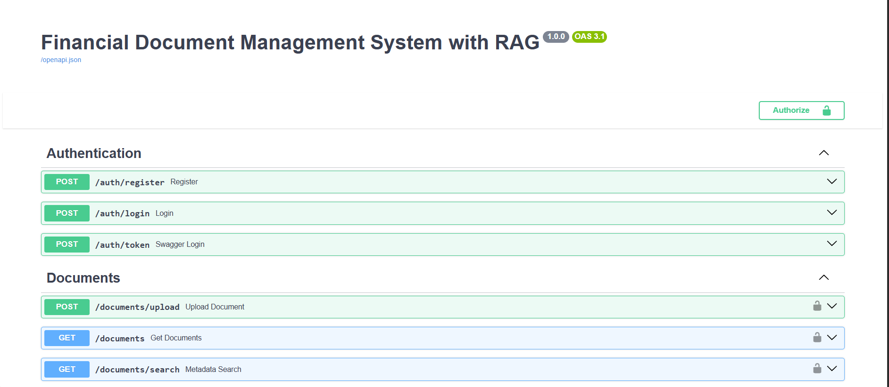

# FastAPI-Financial-Document-Management

# FastAPI Financial Document Management System with RAG

A FastAPI backend for managing financial PDF documents with JWT authentication, role-based access control, metadata search, and Retrieval-Augmented Generation (RAG) powered by Sentence Transformers and Qdrant.

The system allows users to register/login, upload financial PDFs, search document metadata, index PDF content into vector embeddings, and retrieve the most relevant document chunks for a natural-language query.

## Features

- JWT-based authentication
- User registration and login
- Role-based access control
- Default roles: `Admin`, `Analyst`, `Auditor`, `Client`
- Default admin account created at startup
- PDF-only document upload
- Document listing, detail, metadata search, and deletion
- SQLite database support by default
- Configurable database URL through environment variables
- PDF text extraction with `PyPDF2`
- Text chunking for vector search
- Sentence embedding with `sentence-transformers`
- Qdrant vector database integration
- RAG search endpoint returning top matching document chunks
- Interactive API documentation with Swagger UI and ReDoc

## Tech Stack

- Python
- FastAPI
- SQLAlchemy
- Pydantic Settings
- SQLite
- JWT / python-jose
- Passlib / bcrypt
- PyPDF2
- Sentence Transformers
- Qdrant
- Uvicorn

## Project Structure

```text
.
+-- app/
|   +-- db/
|   |   +-- database.py
|   +-- models/
|   |   +-- document.py
|   |   +-- role.py
|   |   +-- user.py
|   +-- routes/
|   |   +-- auth.py
|   |   +-- documents.py
|   |   +-- rag.py
|   +-- schemas/
|   |   +-- document.py
|   |   +-- role.py
|   |   +-- user.py
|   +-- services/
|   |   +-- auth_service.py
|   |   +-- document_service.py
|   |   +-- rag_service.py
|   +-- utils/
|   |   +-- file_handler.py
|   |   +-- jwt.py
|   +-- config.py
|   +-- main.py
+-- SS/
+-- uploads/
+-- requirements.txt
+-- financial_documents.db
+-- LICENSE
+-- README.md
```

## Prerequisites

Make sure these are installed on your system:

- Python 3.10 or above
- pip
- Qdrant, for RAG indexing and search

Qdrant can be started with Docker:

```bash
docker run -p 6333:6333 -p 6334:6334 qdrant/qdrant
```

If Docker is not available, install and run Qdrant using the official Qdrant installation method for your operating system.

## Installation

1. Clone the repository:

```bash
git clone https://github.com/your-username/FastAPI-Financial-Document-Management.git
cd FastAPI-Financial-Document-Management
```

2. Create a virtual environment:

```bash
python -m venv .venv
```

3. Activate the virtual environment.

On Windows:

```bash
.venv\Scripts\activate
```

On macOS/Linux:

```bash
source .venv/bin/activate
```

4. Install dependencies:

```bash
pip install -r requirements.txt
```

5. Create a `.env` file in the project root:

```env
DATABASE_URL=sqlite:///./financial_documents.db
JWT_SECRET_KEY=replace-with-a-strong-secret-key
JWT_ALGORITHM=HS256
ACCESS_TOKEN_EXPIRE_MINUTES=60
UPLOADS_DIR=uploads
QDRANT_URL=http://localhost:6333
QDRANT_COLLECTION=financial_document_chunks
QDRANT_API_KEY=
EMBEDDING_MODEL_NAME=all-MiniLM-L6-v2
SAMPLE_ADMIN_EMAIL=admin@example.com
SAMPLE_ADMIN_PASSWORD=Admin@123
```

6. Start the FastAPI server:

```bash
uvicorn app.main:app --reload
```

The application will be available at:

```text
http://127.0.0.1:8000
```

## API Documentation

After starting the server, open:

- Swagger UI: `http://127.0.0.1:8000/docs`
- ReDoc: `http://127.0.0.1:8000/redoc`

## Default Admin User

On application startup, the project creates default roles and a sample admin user if they do not already exist.

Default credentials:

```text
Email: admin@example.com
Password: Admin@123
```

These values can be changed in the `.env` file:

```env
SAMPLE_ADMIN_EMAIL=admin@example.com
SAMPLE_ADMIN_PASSWORD=Admin@123
```

For production, always replace the default credentials and use a strong `JWT_SECRET_KEY`.

## Roles and Permissions

| Role | Permissions |
| --- | --- |
| Admin | Upload documents, list documents, search documents, view documents, delete documents, index documents, perform RAG search |
| Analyst | Upload documents, list documents, search documents, view documents, index documents, perform RAG search |
| Auditor | List documents, search documents, view documents, perform RAG search |
| Client | List documents, search documents, view documents, perform RAG search |

## API Endpoints

### Health Check

| Method | Endpoint | Description | Auth Required |
| --- | --- | --- | --- |
| GET | `/` | Check server status | No |

### Authentication

| Method | Endpoint | Description | Auth Required |
| --- | --- | --- | --- |
| POST | `/auth/register` | Register a new user | No |
| POST | `/auth/login` | Login with JSON body | No |
| POST | `/auth/token` | OAuth2-compatible login for Swagger UI | No |

### Documents

| Method | Endpoint | Description | Auth Required | Allowed Roles |
| --- | --- | --- | --- | --- |
| POST | `/documents/upload` | Upload a PDF document | Yes | Admin, Analyst |
| GET | `/documents` | List all documents | Yes | All roles |
| GET | `/documents/search` | Search documents by metadata | Yes | All roles |
| GET | `/documents/{document_id}` | Get document details | Yes | All roles |
| DELETE | `/documents/{document_id}` | Delete a document | Yes | Admin |

### RAG

| Method | Endpoint | Description | Auth Required | Allowed Roles |
| --- | --- | --- | --- | --- |
| POST | `/rag/index-document` | Extract PDF text, split it into chunks, create embeddings, and store vectors in Qdrant | Yes | Admin, Analyst |
| POST | `/rag/search` | Search indexed document chunks using a natural-language query | Yes | All roles |

## Request Examples

### Register User

```bash
curl -X POST "http://127.0.0.1:8000/auth/register" \
  -H "Content-Type: application/json" \
  -d '{
    "email": "analyst@example.com",
    "full_name": "Financial Analyst",
    "password": "Password123",
    "role_name": "Analyst"
  }'
```

### Login

```bash
curl -X POST "http://127.0.0.1:8000/auth/login" \
  -H "Content-Type: application/json" \
  -d '{
    "email": "admin@example.com",
    "password": "Admin@123"
  }'
```

Response:

```json
{
  "access_token": "your-jwt-token",
  "token_type": "bearer"
}
```

Use the token in protected routes:

```bash
Authorization: Bearer your-jwt-token
```

### Upload Document

```bash
curl -X POST "http://127.0.0.1:8000/documents/upload" \
  -H "Authorization: Bearer your-jwt-token" \
  -F "title=Annual Report 2024" \
  -F "company_name=IRM Energy" \
  -F "document_type=report" \
  -F "file=@IRM Energy.pdf"
```

Allowed document types:

```text
invoice
report
contract
```

### Search Documents by Metadata

```bash
curl -X GET "http://127.0.0.1:8000/documents/search?company_name=IRM&document_type=report" \
  -H "Authorization: Bearer your-jwt-token"
```

### Index a Document for RAG

```bash
curl -X POST "http://127.0.0.1:8000/rag/index-document" \
  -H "Authorization: Bearer your-jwt-token" \
  -H "Content-Type: application/json" \
  -d '{
    "document_id": 1
  }'
```

Response:

```json
{
  "document_id": 1,
  "indexed_chunks": 25
}
```

### Search Indexed Document Content

```bash
curl -X POST "http://127.0.0.1:8000/rag/search" \
  -H "Authorization: Bearer your-jwt-token" \
  -H "Content-Type: application/json" \
  -d '{
    "query": "What is the annual report about?"
  }'
```

Response:

```json
{
  "results": [
    {
      "text": "Relevant extracted document chunk...",
      "document_id": 1,
      "score": 0.82
    }
  ]
}
```

## RAG Workflow

1. Upload a PDF using `/documents/upload`.
2. Index the uploaded document using `/rag/index-document`.
3. The system extracts text from the PDF.
4. Extracted text is split into overlapping chunks.
5. Each chunk is converted into an embedding using the configured Sentence Transformer model.
6. Embeddings and chunk metadata are stored in Qdrant.
7. Search indexed chunks with `/rag/search`.

## Configuration

The application uses `pydantic-settings` and reads configuration from `.env`.

| Variable | Default | Description |
| --- | --- | --- |
| `DATABASE_URL` | `sqlite:///./financial_documents.db` | SQLAlchemy database connection URL |
| `JWT_SECRET_KEY` | Development default in code | Secret key used to sign JWT tokens |
| `JWT_ALGORITHM` | `HS256` | JWT signing algorithm |
| `ACCESS_TOKEN_EXPIRE_MINUTES` | `60` | Access token expiry duration |
| `UPLOADS_DIR` | `uploads` | Directory where uploaded PDFs are stored |
| `QDRANT_URL` | `http://localhost:6333` | Qdrant server URL |
| `QDRANT_COLLECTION` | `financial_document_chunks` | Qdrant collection name |
| `QDRANT_API_KEY` | Empty | Optional Qdrant API key |
| `EMBEDDING_MODEL_NAME` | `all-MiniLM-L6-v2` | Sentence Transformer model name |
| `SAMPLE_ADMIN_EMAIL` | `admin@example.com` | Default admin email |
| `SAMPLE_ADMIN_PASSWORD` | `Admin@123` | Default admin password |

## Screenshots

Screenshots are stored in the `SS/` directory.

```text
SS/
+-- FastAPI.png
+-- FastAPI-2.png
+-- Fast_API-3.png
+-- Fast API LogIn.png
+-- VS Code.png
```

You can add them to this README with Markdown image links after pushing the repository:

```md


```

## Troubleshooting

### Qdrant is unavailable

Make sure Qdrant is running:

```bash
docker run -p 6333:6333 -p 6334:6334 qdrant/qdrant
```

Then verify:

```text
http://localhost:6333
```

### First RAG request is slow

The first indexing or search request may take longer because the Sentence Transformer model is loaded into memory on demand.

### No extractable text found in PDF

Some PDFs are scanned images and do not contain embedded text. This project uses `PyPDF2`, which extracts text from text-based PDFs only.

### Unauthorized request

Protected endpoints require this header:

```text
Authorization: Bearer your-jwt-token
```

Login through `/auth/login` or `/auth/token` to get a token.

## Development Notes

- Database tables are created automatically on application startup.
- Uploaded PDF files are saved inside the configured uploads directory.
- Re-indexing a document removes the old vector chunks for that document before inserting new chunks.
- RAG search returns the top 5 reranked chunks from Qdrant results.
- Do not commit `.env`, uploaded files, virtual environments, logs, or local database files to a public repository.

## License

This project is licensed under the terms of the [MIT License](LICENSE).
